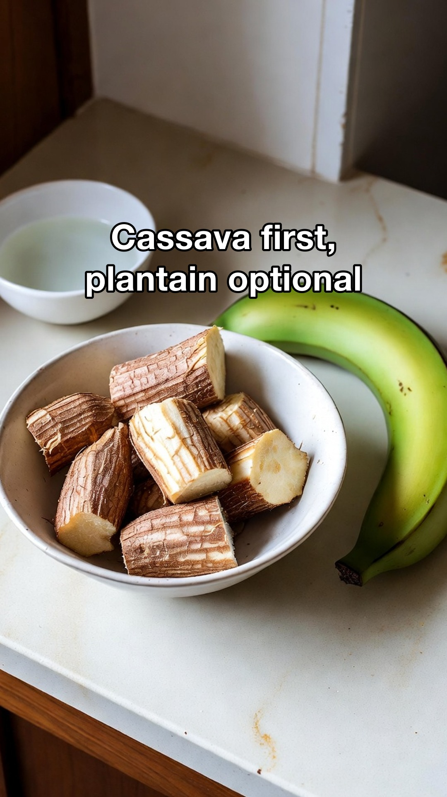
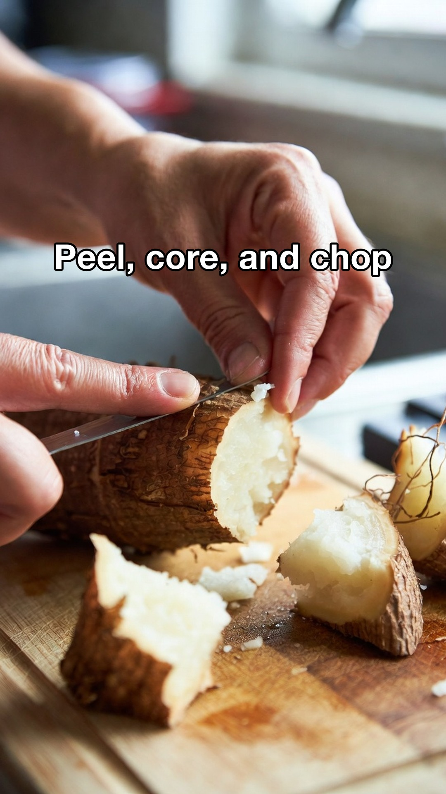
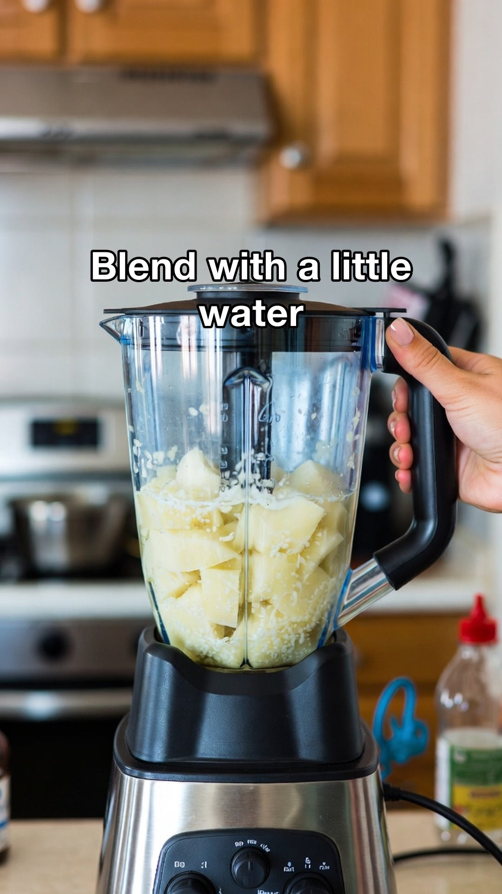
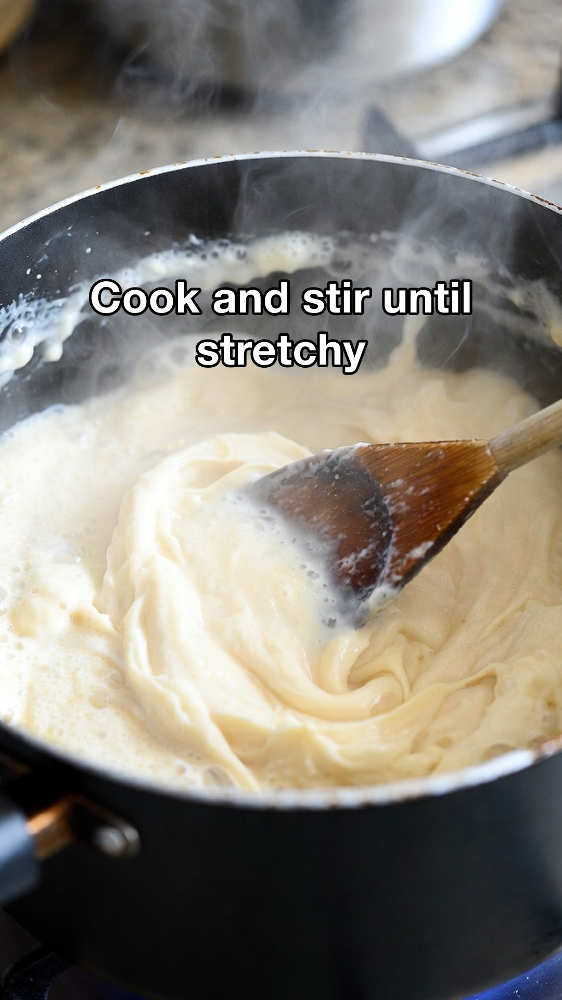

<p align="center">
  
</p>

<h1 align="center">Content Engine</h1>

<p align="center">
  AI-powered content engine for videos and carousels.<br/>
  Say it in plain English, post it everywhere.
</p>

<p align="center">
  <a href="https://github.com/intelligent-iterations/content-engine/actions/workflows/ci.yml"></a>
  <a href="LICENSE"></a>
  = 18" />
  <a href="https://discord.gg/DEGQX9RVNn"></a>
</p>

---

Content Engine turns plain-English prompts into publish-ready videos and carousels for TikTok, Instagram, and X. Open the repo in [Claude Code](https://claude.ai) or [Codex](https://openai.com/codex), describe what you want, and the agent handles research, template selection, asset generation, captioning, and scheduled posting.

Everything is **template-first** — your ideas become reusable formats, not throwaway prompts. Generation is powered by **Grok** (API key or browser session), so you can produce content with or without an xAI API key. Approved assets flow into a scheduling queue that posts on your behalf.

## Example

Example output:

<video src="example/fruit-revenge-arc-api-portrait/fruit-revenge-arc-api-portrait.mp4" poster="example/fruit-revenge-arc-api-portrait/example-frame.jpg" controls muted playsinline width="360"></video>

[`example/fruit-revenge-arc-api-portrait/fruit-revenge-arc-api-portrait.mp4`](example/fruit-revenge-arc-api-portrait/fruit-revenge-arc-api-portrait.mp4)

This is the current reference example for the video pipeline. It was generated from saved repo state, not a one-off prompt, and it follows the intended chain:

`hero portrait -> reference sheet -> portrait scene-start frame -> clip -> stitched final`

Example carousel:

<p>
  <a href="example/fufu-how-to-carousel/preview.html"></a>
  <a href="example/fufu-how-to-carousel/preview.html"></a>
  <a href="example/fufu-how-to-carousel/preview.html"></a>
  <a href="example/fufu-how-to-carousel/preview.html"></a>
</p>
<p>
  <a href="example/fufu-how-to-carousel/preview.html"></a>
  <a href="example/fufu-how-to-carousel/preview.html"></a>
  <a href="example/fufu-how-to-carousel/preview.html"></a>
</p>

- Preview: [`example/fufu-how-to-carousel/preview.html`](example/fufu-how-to-carousel/preview.html)
- Research artifact: [`example/fufu-how-to-carousel/research.json`](example/fufu-how-to-carousel/research.json)

## What It Makes

- **Videos** — short-form viral clips, multi-clip story arcs, promos, character pieces, ASMR-style content
- **Carousels** — educational breakdowns, comparison lists, product showcases
- **Auto-captioned assets** — post captions plus burned-in on-video dialogue captions for video workflows
- **Cost tracking** — xAI spend logging, monthly budget warnings, and hard caps for API-backed generation and posting
- **Scheduled posts** — queue approved content for TikTok, Instagram, and X

## Quick Start

```bash
npm install
pip install -r requirements.txt
npx playwright install chromium
cp .env.example .env
```

Optionally add your `XAI_API_KEY` to `.env`, or rely on browser-based Grok session reuse.

If you use an xAI API key, you can also set a soft monthly budget and a hard monthly cap:

```bash
XAI_SPEND_BUDGET_USD=25
XAI_SPEND_CAP_USD=40
```

Then open the repo in Claude Code or Codex and ask:

```text
generate a video about a tired founder who clones himself to finish work
```

```text
generate a carousel about how to season a cast iron pan
```

```text
generate a 3-clip promo video for a local bakery
```

Or run the saved revenge-arc example directly:

```bash
BROWSER_OVERRIDE=false node code/cli/video.js "bullied orange serum revenge cafeteria drama" \
  --template anthropomorphic-fruit-revenge-drama \
  --md example/fruit-revenge-arc-api-portrait/fruit-revenge-arc-api-portrait.md
```

## How It Works

1. **You describe** what you want in plain English
2. **The agent researches** the format and finds or creates a reusable template
3. **Grok generates** images and video clips from the template's prompt contract
4. **The pipeline stitches** clips, adds captions, and saves all artifacts
5. **You approve** and the agent queues the asset for scheduled posting

For video work, the agent can scaffold a saved compilation markdown and `asset-manifest.json` from the selected template before rendering. That makes formats like fruit drama reusable without hardcoding fruit-specific logic into the renderer.

The repo now also has a higher-level video workflow CLI for `prepare`, `render`, `queue`, and `ship`, so the operational path is: define the reusable template/run artifacts, render the output, then move it into the scheduled posting queue.

For continuity-sensitive story videos, the default chain is:

`hero portrait -> reference sheet -> portrait scene-start frame -> clip -> stitched final`

## Auth Model

There are two separate auth tracks:

**Grok (generation)** — works with `XAI_API_KEY` in `.env` or via browser cookies extracted from Chrome (`npm run auth:grok`). Generation works without an API key.

When `XAI_API_KEY` is used, billable xAI calls are tracked under `output/tracking/`. Run `npm run spend:report` to inspect the current totals.

**Platform posting** — requires saved cookies for each platform. Run `npm run auth:posting` (or platform-specific variants like `npm run auth:posting:tiktok`) to extract session cookies from Chrome.

See [docs/INSTALLATION.md](docs/INSTALLATION.md) for the full setup guide.

For Dockerized posting/generation on hosts where `docker compose build` is missing `buildx`, use `npm run docker:build`. It builds both local images and falls back to direct `docker build` when needed.

## Documentation

- [Installation Guide](docs/INSTALLATION.md)
- [Video Templates](docs/VIDEO_TEMPLATES.md)
- [Carousel Templates](docs/CAROUSEL_TEMPLATES.md)
- [Scheduled Posting Queue](docs/SCHEDULED_POSTING_QUEUE.md)
- [Crosspost to Instagram](docs/CROSSPOST_TO_INSTAGRAM.md)

## License

[MIT](LICENSE)
